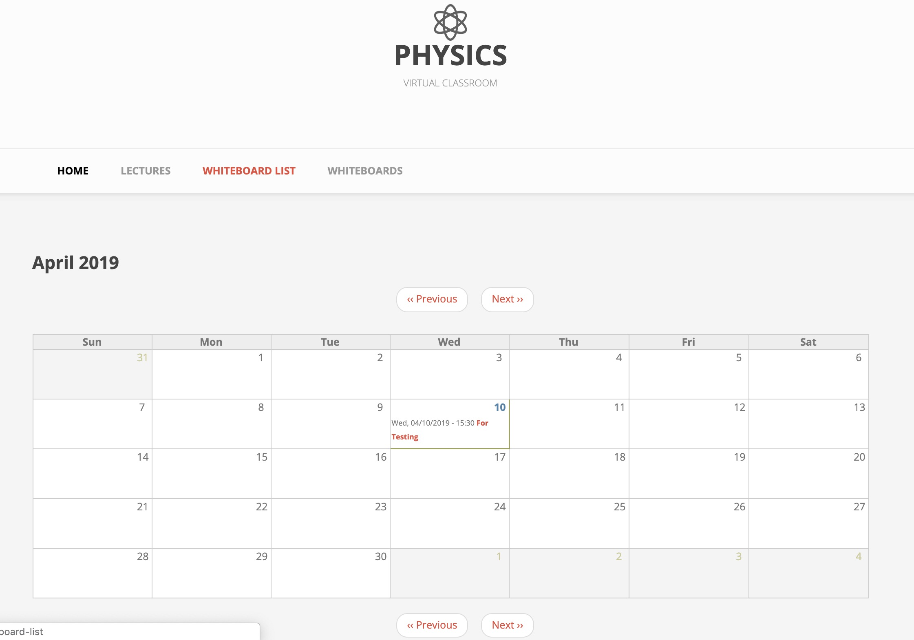

# Project - Physics Virtual Classroom by Group 51 (AsyncSync)
> Oregon State University - Computer Science Capstone Project

This is the project for Senior capstone project in Oregon State University.
AsyncSync by Physics Department

Link for the website: <http://drupal.maxcasts.com/> (This URL is not available anymore)

## Requirement

>Refer to our [Guide Document](/new_document/guide_documents_group51/guide_doc_group51.pdf) for all detailed installation of our backup Drupal

We are using Drupal8 as our developing environment.
Any requirement will be installed if you follow the intallation below.
Any other requirement for using Drupal8, refer to the following link [Drupal8](https://www.drupal.org/docs/8/system-requirements "Drupal8 link title")

## Note (You have to read this note before doing further actions)

* The whole code for the current project is under "html" folder
* You must use 'sqlbackup.sql' file for building the whole website.
* Documents folder is for all the documentation of the project
* ph-virtual-classroom is the code we worked on. Now, we don't use the code anymore...
* The code in this repository only gives you make a simple website. (in 'html' folder)
* The site can't do any functions without the current server-database. (in 'html' folder)

## Useful Links
* [Drupal8 Download](https://www.drupal.org/download "Drupal8 Download link title")
* [Install Drupal on MacOS](https://www.youtube.com/watch?v=pOBArJn-tSQ "Install Drupal on MacOS link title")
* [Install Drupal on Ubuntu18.04](https://www.youtube.com/watch?v=9SEpG0rOs1w "Install Drupal on Ubuntu18.04 link title")
* [Install Drupal on Windows](https://www.youtube.com/watch?v=4Gl9s40vldY "Install Drupal on Windows link title")
* Note: We haven't tried installing Drupal on Windows yet, but the installation should be the same.

Useful link for MacOS and Windows:
Download MAMP: [MAMP Download](https://www.mamp.info/en/downloads/ "MAMP Download link title")

## Authors

* **Jaehyung You** - *(ONID: youja)* [youja@oregonstate.edu]
* **Yeongae Lee** - *(ONID: leeye)* [leeye@oregonstate.edu]
